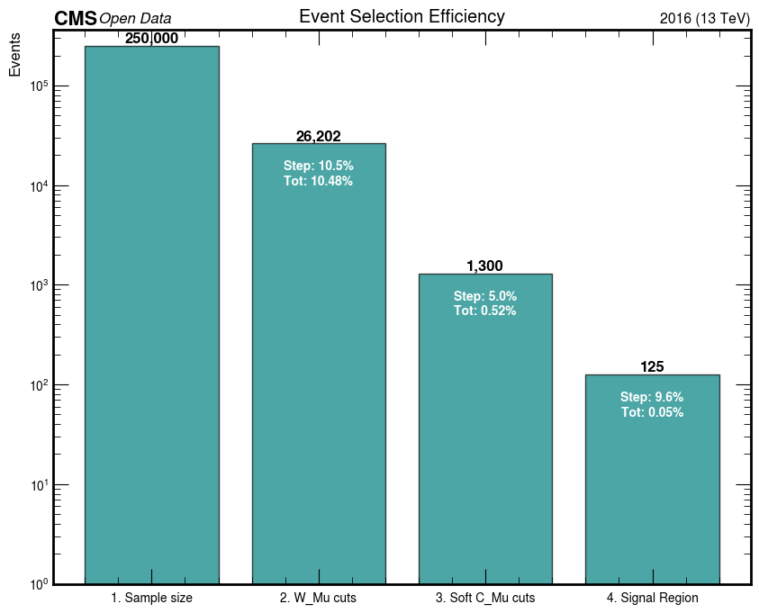
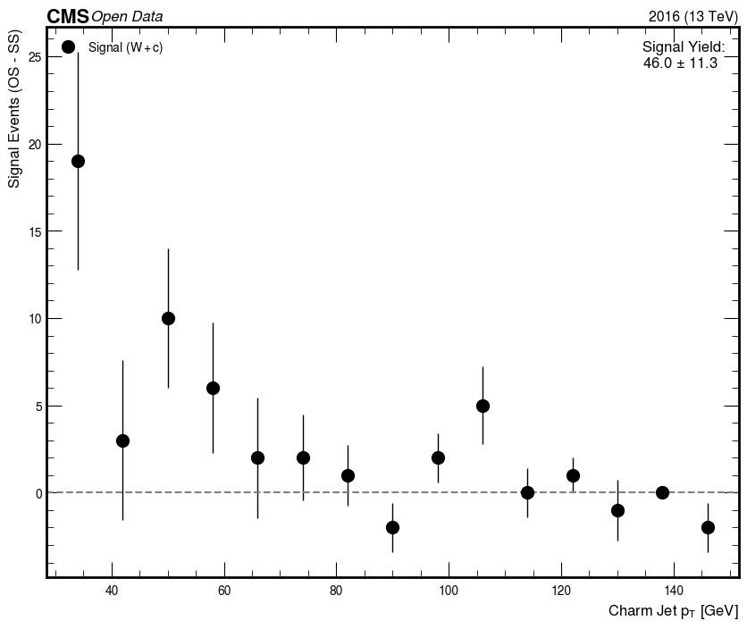

### Event Yields for 250,000 Generated Events
**Dataset:** `W1JetsToLNu_TuneCP5_13TeV-madgraphMLM-pythia8`

| Cut Stage | Reduction Factor | Exp. Events (per 250k) | Justification |
| :--- | :--- | :--- | :--- |
| **1. Total Gen Events** | 1.00 | **250,000** | Initial Sample Size |
| **2a. W Decay ($W \to \mu\nu$)** | 0.33 | **~83,333** | Lepton Universality ($e:\mu:\tau = 1:1:1$) |
| **2b. W Selection** | ~0.31 | **~26,202** | Detector Acceptance ($abs(\eta)<2.4$), Trigger Threshold ($p_T>30$), and Tight ID/Iso (<0.15) **Here $p_T>30$ is killing half of the W (only 39,743/83,333 pass)** |
| **3a. Charm Jet Fraction** | ~0.12 | **~30,000** | Fraction of W+Jets events containing a $c$-quark (dominated by $g+s \to W+c$). |
| **3b. Charm Tagging ($c \to \mu$)** | ~0.0425 | **~1300** | **The Bottleneck**:  1. $BR(c \to \mu) \approx 9.6\%$  2. Soft Muon Reco & other cut Efficiency $\approx 45\%$ ****Here Jet Kinematic Cuts (Matched_Jets.pt > 30) is strongest (only 1300/8959 soft mu pass)****|

### Signal Composition
After all cuts, the signal (w/o os-ss) is like ~0.05% of the total sample. (125 / 250,000 events) will consist of:
* **Signal (OS)**: Events where $Charge(\mu_W) \neq Charge(\mu_{jet})$. This is the $W+c$ signal. 
* **Background (OS+SS)**: Events from $W+b\bar{b}$ (top) or gluon splitting $g \to c\bar{c}$. These produce OS and SS events equally.
* **Analysis Strategy**: `N(OS) - N(SS)` to remove the background and isolate the pure $W+c$ signal count. 

## So, With OS-SS it's ~ 0.02%
